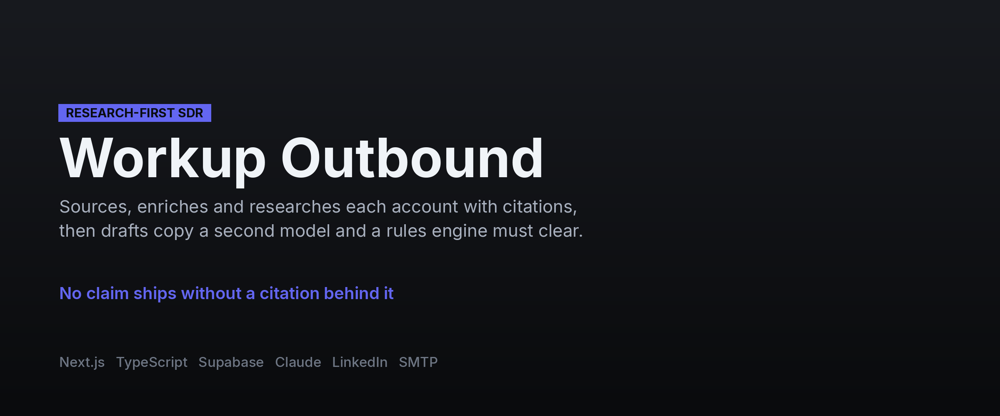
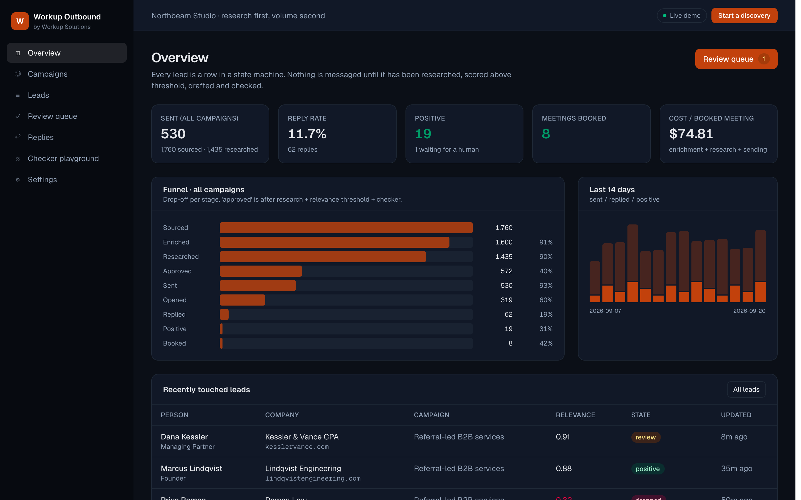

**[← All systems](https://github.com/musabqazi)** · [Workup Voice](https://github.com/musabqazi/workup-voice) · [Workup Chat](https://github.com/musabqazi/workup-chat) · [Workup Operator](https://github.com/musabqazi/workup-operator)

# Workup Outbound — research-first AI SDR

End-to-end outbound pipeline: sourcing, enrichment, CRM dedup, per-account research with
citations, drafted copy that a second model and a rules engine check, sending over email and
LinkedIn inside safe limits, reply classification, meeting tracking and a funnel dashboard.
Built under the client's own accounts.

working checker playground). **Spec:** [SPEC.md](SPEC.md)

🟢 **Live demo:** https://workup-outbound.vercel.app · **Source:** private, available on request

## Dashboard

The SDR funnel: accounts sourced, researched and drafted, with the checks each message cleared before it could send.

## The problem

Outbound depends on one person; generic AI blasts burn domains; nobody can see what works.

## What it does

1. **Source, enrich, dedup.** CSV / Apollo / Crustdata / Workup Leads. Verified email, LinkedIn,
   headcount, tech. Deduped against HubSpot and prior campaigns first.
2. **Research and score.** Firecrawl reads the site, posts, job ads and news. Sonnet writes a brief
   with numbered citations and a relevance score. Below 0.60 is dropped and never messaged.
3. **Draft, then check.** Model A drafts a 3-step sequence + LinkedIn note. Model B and
   deterministic rules ([lib/checker.ts](lib/checker.ts), mirrored in
   [pipeline/checker.py](pipeline/checker.py)) require: every claim cites the brief, step 1 under
   90 words, one CTA, no superlatives or fake urgency, no placeholders, names match the record,
   tone matches the campaign's voice sample. One retry, then a human review queue.
4. **Send, classify, book.** Instantly / Smartlead for email, Unipile for LinkedIn, daily caps and a
   suppression list on every send. Replies classified by Haiku: OOO and unsubscribe auto-handled,
   interested routed to a human with a suggested reply and a booking link. Cal.com webhook marks
   the meeting.

## How it holds in production

Every stage is an idempotent arq job; a lead is a state-machine row that only moves forward.
Dry-run mode produces everything and sends nothing. Golden set of 50 leads with expected briefs and
drop decisions; adversarial checker tests. Langfuse traces every model call.

## Stack

    

## A note on what you can see here

The live demo runs on **seeded demo data** — a fictional tenant and synthetic records throughout. No client data appears in the demo or in this repository, and the implementation is private.

---
Part of the <a href="https://github.com/musabqazi">musabqazi portfolio</a> · A <b>Workup Solutions</b> product · source private. © 2026 Musab Qazi
